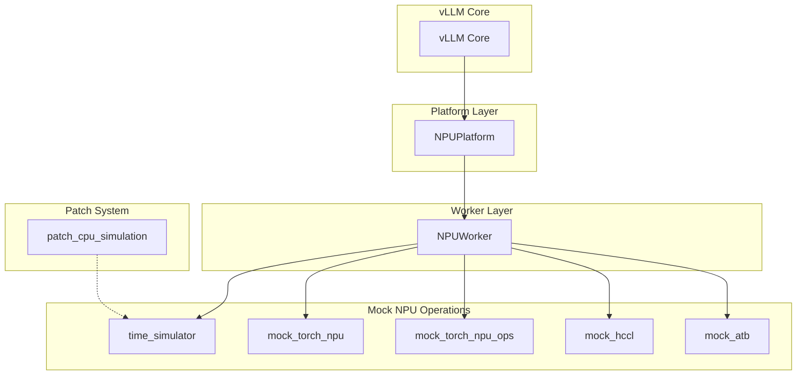
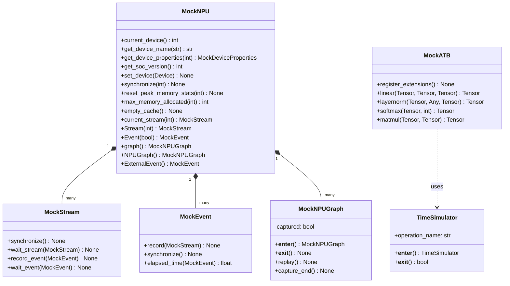
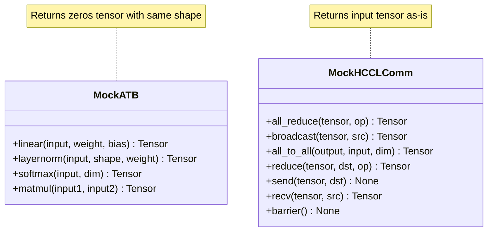
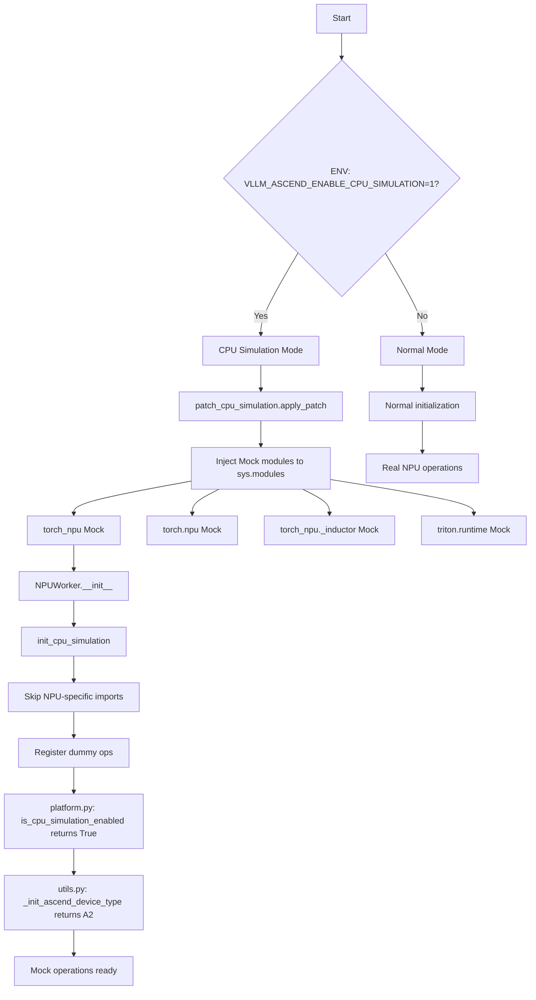
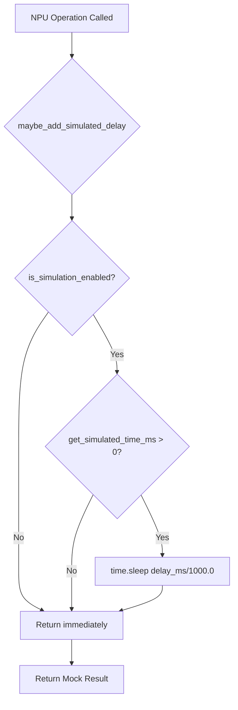
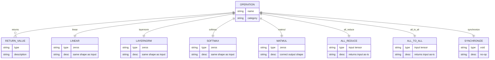
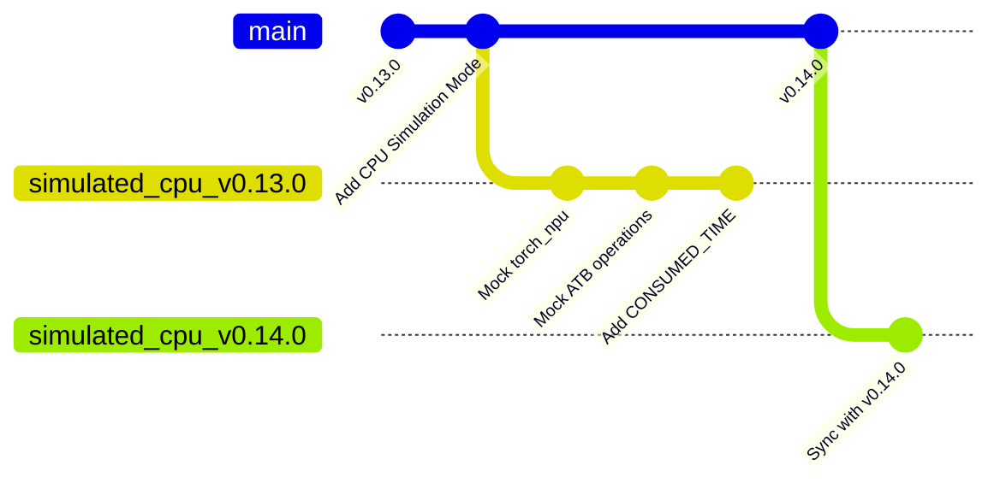

# CPU Simulation Mode UML Diagrams

## 1. 架构分层图

```mermaid
graph TB
    subgraph "vLLM Core"
        VLLM[vLLM Core]
    end

    subgraph "Platform Layer"
        NP[ NPUPlatform]
    end

    subgraph "Worker Layer"
        W[ NPUWorker]
    end

    subgraph "Mock NPU Operations"
        MTP[ time_simulator]
        MTN[ mock_torch_npu]
        MTNO[ mock_torch_npu_ops]
        MH[ mock_hccl]
        MA[ mock_atb]
    end

    subgraph "Patch System"
        PS[ patch_cpu_simulation]
    end

    VLLM --> NP
    NP --> W
    W --> MTP
    W --> MTN
    W --> MTNO
    W --> MH
    W --> MA
    PS -.-> MTP
```

## 2. 类图

```mermaid
classDiagram
    class MockNPU {
        +current_device() int
        +get_device_name(str) str
        +get_device_properties(int) MockDeviceProperties
        +get_soc_version() int
        +set_device(Device) None
        +synchronize(int) None
        +reset_peak_memory_stats(int) None
        +max_memory_allocated(int) int
        +empty_cache() None
        +current_stream(int) MockStream
        +Stream(int) MockStream
        +Event(bool) MockEvent
        +graph() MockNPUGraph
        +NPUGraph() MockNPUGraph
        +ExternalEvent() MockEvent
    }

    class MockStream {
        +synchronize() None
        +wait_stream(MockStream) None
        +record_event(MockEvent) None
        +wait_event(MockEvent) None
    }

    class MockEvent {
        +record(MockStream) None
        +synchronize() None
        +elapsed_time(MockEvent) float
    }

    class MockNPUGraph {
        -captured: bool
        +__enter__() MockNPUGraph
        +__exit__() None
        +replay() None
        +capture_end() None
    }

    class MockATB {
        +register_extensions() None
        +linear(Tensor, Tensor, Tensor) Tensor
        +layernorm(Tensor, Any, Tensor) Tensor
        +softmax(Tensor, int) Tensor
        +matmul(Tensor, Tensor) Tensor
    }

    class TimeSimulator {
        +operation_name: str
        +__enter__() TimeSimulator
        +__exit__() bool
    }

    MockNPU "1" *-- "many" MockStream
    MockNPU "1" *-- "many" MockEvent
    MockNPU "1" *-- "many" MockNPUGraph
    MockATB ..> TimeSimulator : uses
```

## 3. Mock 操作返回值类图

```mermaid
classDiagram
    class MockATB {
        +linear(input, weight, bias) Tensor
        +layernorm(input, shape, weight) Tensor
        +softmax(input, dim) Tensor
        +matmul(input1, input2) Tensor
    }

    class MockHCCLComm {
        +all_reduce(tensor, op) Tensor
        +broadcast(tensor, src) Tensor
        +all_to_all(output, input, dim) Tensor
        +reduce(tensor, dst, op) Tensor
        +send(tensor, dst) None
        +recv(tensor, src) Tensor
        +barrier() None
    }

    note for MockATB "Returns zeros tensor with same shape"
    note for MockHCCLComm "Returns input tensor as-is"
```

## 4. 初始化流程图

```mermaid
flowchart TD
    A[Start] --> B{ENV: VLLM_ASCEND_ENABLE_CPU_SIMULATION=1?}
    B -->|No| C[Normal Mode]
    B -->|Yes| D[CPU Simulation Mode]

    D --> E[patch_cpu_simulation.apply_patch]
    E --> F[Inject Mock modules to sys.modules]

    F --> G[torch_npu Mock]
    F --> H[torch.npu Mock]
    F --> I[torch_npu._inductor Mock]
    F --> J[triton.runtime Mock]

    G --> K[NPUWorker.__init__]
    K --> L[init_cpu_simulation]
    L --> M[Skip NPU-specific imports]
    M --> N[Register dummy ops]

    N --> O[platform.py: is_cpu_simulation_enabled returns True]
    O --> P[utils.py: _init_ascend_device_type returns A2]
    P --> Q[Mock operations ready]

    C --> R[Normal initialization]
    R --> S[Real NPU operations]
```

## 5. 时间模拟流程图

```mermaid
flowchart TD
    A[NPU Operation Called] --> B{maybe_add_simulated_delay}

    B --> C{is_simulation_enabled?}
    C -->|No| D[Return immediately]
    C -->|Yes| E{get_simulated_time_ms > 0?}

    E -->|No| D
    E -->|Yes| F[time.sleep delay_ms/1000.0]
    F --> D

    D --> G[Return Mock Result]
```

## 6. 假值返回策略表

```mermaid
erDiagram
    OPERATION ||--o{ RETURN_VALUE : returns
    OPERATION {
        string name
        string category
    }
    RETURN_VALUE {
        string type
        string description
    }

    OPERATION ||--|| LINEAR : linear
    OPERATION ||--|| LAYERNORM : layernorm
    OPERATION ||--|| SOFTMAX : softmax
    OPERATION ||--|| MATMUL : matmul
    OPERATION ||--|| ALL_REDUCE : all_reduce
    OPERATION ||--|| ALL_TO_ALL : all_to_all
    OPERATION ||--|| SYNCHRONIZE : synchronize

    LINEAR {
        string type "zeros"
        string desc "same shape as input"
    }
    LAYERNORM {
        string type "zeros"
        string desc "same shape as input"
    }
    SOFTMAX {
        string type "zeros"
        string desc "same shape as input"
    }
    MATMUL {
        string type "zeros"
        string desc "correct output shape"
    }
    ALL_REDUCE {
        string type "input tensor"
        string desc "returns input as-is"
    }
    ALL_TO_ALL {
        string type "input tensor"
        string desc "returns input as-is"
    }
    SYNCHRONIZE {
        string type "void"
        string desc "no-op"
    }
```

## 7. 版本演进图

```mermaid
gitGraph
   commit id: "v0.13.0"
   commit id: "Add CPU Simulation Mode"
   branch simulated_cpu_v0.13.0
   checkout simulated_cpu_v0.13.0
   commit id: "Mock torch_npu"
   commit id: "Mock ATB operations"
   commit id: "Add CONSUMED_TIME"
   checkout main
   commit id: "v0.14.0"
   branch simulated_cpu_v0.14.0
   checkout simulated_cpu_v0.14.0
   commit id: "Sync with v0.14.0"
```
